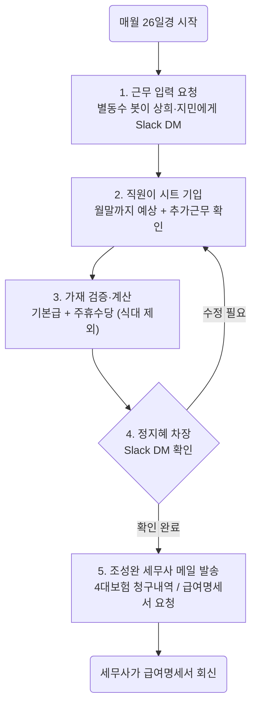

# 워크플로우: 월간 단기직원 급여 → 세무사 급여명세서 요청

> 일반업무 워크플로우 · 매월 1회 · 대상: 김상희·김지민(단기직원)
>
> 🎨 **Figma(FigJam) 다이어그램:** https://www.figma.com/board/TB9eM9ydMNCPJL6dQTTrLA

## 개요

매월 말 무렵, 단기직원의 근무일정을 시트에 채워 급여를 계산하고,
담당 차장의 확인을 받은 뒤, 세무사에게 급여명세서를 요청하는 정기 업무.

- **트리거:** 매월 26일경
- **담당(실행):** 가재(자동화) + 이병덕 대표
- **확인(승인):** 담당 차장 — **정지혜 차장**(jj@kspeaks.kr, Slack `U0B6DST2F0S`), **Slack DM으로 확인**
  - 방희영 차장 출산휴가 중
- **외부 수신:** 조성완 세무사 (csw1337@gmail.com)

## 입력 자료 (Google Drive)

| 직원 | 시트 | fileId |
|------|------|--------|
| 김상희 | 김상희(단기직원) 급여 계산 | `1VM1Vk-xK4EG4Es3e0wjleTqhBqw2CW64KR0yVcmOtDY` |
| 김지민 | 김지민(단기직원) 급여 계산 | `1jFxDoYUbAY4SB_2VkFzdge-RoDpnj7mWCUGXo-DL7qI` |

## 단계

### 1) 근무 입력 요청 — Slack DM (각자 1:1)

> 안녕하세요 {이름}님! 이번 달 급여 정산 안내드립니다.
> 급여계산 시트에 **월말까지 예상 근무시간**을 기입해 주세요.
> 그리고 **추가로 근무한 것**이 있으면 확인해 주시면 됩니다.
> ({시트 링크})

### 2) 직원 기입
- 직원이 본인 시트의 해당 월 탭에 근무일정 입력(월말까지 예상 포함).

### 3) 검증·계산 (가재)
- 각 시트의 **해당 월 탭 하단 요약 블록**에서 값을 읽는다.
- **급여액 = 기본급 + 주휴수당** *(식대 제외)*
  - 연장수당이 있으면 포함.
- 검증 포인트: 항목·금액 정합성, 근무일정이 월말까지 채워졌는지.

### 4) 담당 차장 확인
- 대상: **정지혜 차장** (jj@kspeaks.kr, Slack `U0B6DST2F0S`)
- 방식: **Slack DM** (가재가 발송)

> {차장}님, {N}월 단기직원 급여액 확인 부탁드립니다.
> - 김상희: {금액}원 (기본급 {a} + 주휴수당 {b})
> - 김지민: {금액}원 (기본급 {a} + 주휴수당 {b})
> 이대로 세무사님께 급여명세서 요청해도 될까요?

### 5) 세무사 메일 발송 (차장 확인 후)
- **To:** csw1337@gmail.com (조성완 세무사)
- **제목:** `{N}월 코리아스픽스 4대보험 청구내역`
- **첨부:** 대표가 별도 파일(예: 4대보험 청구내역)을 주면 그 파일을 첨부. 없으면 본문만 발송.
- **본문:**

> 세무사님, {N}월 4대보험 청구내역입니다.
> 김상희 샘 이번달 급여액은 {금액} 입니다.
> 김지민 샘 이번달 급여액은 {금액} 입니다.
> 급여명세서 부탁드려요 감사합니다.
>
> 이병덕 대표이사 올림
> (서명)

## 결정 사항 (확정)
- 급여액 = 기본급 + 주휴수당 (**식대 제외**).
- 담당 차장 = **정지혜 차장**, 확인은 **Slack DM**으로.
- 세무사 메일에 "신은재 종합소득세 묶어서 청구" 문구는 **넣지 않는다(제외)**.
- 세무사 메일 첨부 = 대표가 **별도 파일 제공 시 첨부**, 없으면 본문만 발송.

## 참고: 계산 규칙 근거
- 2026년 시급 10,320원. 주휴수당 = 근무시간 × 0.2 × 시급.
- 과거(5월)엔 식대 200,000원을 더했으나, **현재 규칙은 식대 제외**(대표 지시).
